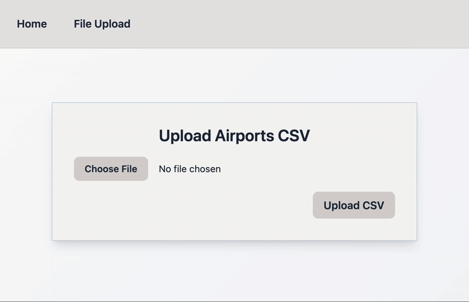
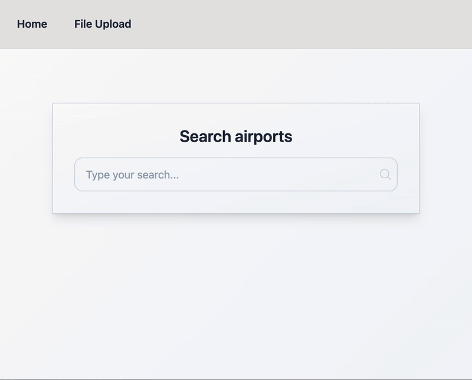

# 🚀 Project description

A web application that allows users to upload a `.csv` file containing a list of airports, which is then automatically stored in a database. Each record includes:

- Airport name
- Location (city and country)
- IATA code (3-letter airport code commonly used in tickets and travel)
- UN/LOCODE (United Nations Location Code — a standardized geographic identifier for cities and ports)

After uploading, users can search and filter the airport database using any of these fields to quickly find specific entries.

Built with NestJS (backend) and React + Vite (frontend), both using TypeScript.

---

## 📸 Screenshots

1. Upload an `airport.csv` file containing a list of airports:




2. Navigate to the homepage to search for and select an airport:



## 🛠 Tech Stack

**Backend:**
- [NestJS](https://nestjs.com/) (v11) with [TypeORM](https://typeorm.io/)
- SQLite for lightweight local database
- RESTful API
- TypeScript

**Frontend:**
- [React 19](https://react.dev/)
- [Vite](https://vitejs.dev/)
- [Tailwind CSS](https://tailwindcss.com/)
- [React Router DOM](https://reactrouter.com/en/main)

---

## 🧑‍💻 Running the project

### Prerequisites
- Node.js ≥ 18
- npm ≥ 9

### 1. Clone the repository

```bash
git clone https://github.com/abt6595819374th/airport-search.git
cd airport-search
```

--- 

### 2. Install dependencies and run applications

### Backend
```
cd backend
npm install
```

#### Run migrations
```
npm run migration:run
```
#### Run the application
```
npm run start
```

### Frontend
```
cd ../frontend
npm install
```

#### Run the application
```
npm run dev
```

###

## 🔗 Launching the application in a web browser

Once both the backend and frontend are running:

- Open a web browser and go to: [http://localhost:5173](http://localhost:5173)  
  This is the frontend UI where you can upload a list of airports from a CSV file and search for airports.

- Navigate to [http://localhost:5173/upload](http://localhost:5173/upload) and upload the `airport.csv` file (located in the root folder of the project).

- Then go to [http://localhost:5173](http://localhost:5173) to search for and select an airport — for example, "Tokyo" or "London".  
  You can also open the `airport.csv` file to view the full list of available airports.

- The search supports filtering by name, IATA code, UN/LOCODE, country, and city.


